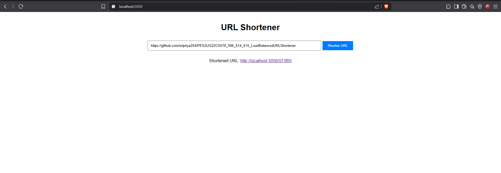

# PES2UG22CS578_596_614_615_LoadBalancedURLShortener

A scalable URL shortener service built with Flask and Redis, featuring Kubernetes deployment and horizontal pod auto-scaling.

## Prerequisites
- Docker
- Minikube
- kubectl
- Homebrew (for macOS)

## Project Structure
.
├── app/
│   ├── Dockerfile
│   ├── app.py
│   ├── requirements.txt
│   └── templates/
│       └── index.html
└── k8s/
    ├── hpa.yaml
    ├── redis-deployment.yaml
    └── url-shortener-deployment.yaml

## Week 1: Local Development
### To run 
1. First run redis container
   docker run -d --name redis -p 6379:6379 redis

2. Then build the dockerfile
   docker build -t url-shortener ./app

3. Run the dockerfile
   docker run -d --name url-app --link redis -p 5050:5000 url-shortener

4. The website should be hosted on localhost:5050
   

## Week 2: Kubernetes Deployment

### Setup Steps

1. Initialize Environment
   minikube start
   eval $(minikube -p minikube docker-env)

2. Build and Deploy
   cd app
   docker build -t url-shortener:latest .
   cd ../k8s

   kubectl apply -f redis-deployment.yaml
   kubectl apply -f url-shortener-deployment.yaml

3. Verify Deployment
   kubectl get pods -l app=redis
   kubectl get pods -l app=url-shortener -w
   kubectl get services

4. Enable External Access
   # Terminal 1: Start tunnel
   minikube tunnel

   # Terminal 2: Get service IP
   kubectl get service url-shortener-service

   Access application at http://<EXTERNAL-IP>

## Week 3: Auto-scaling Implementation

### Setup Steps

1. Enable Auto-scaling
   # Enable metrics server
   minikube addons enable metrics-server

   # Apply HPA configuration
   kubectl apply -f k8s/hpa.yaml

2. Monitor System
   # Check deployments
   kubectl get pods -l app=redis
   kubectl get pods -l app=url-shortener -w
   kubectl get services
   kubectl get hpa

   # Monitor metrics
   kubectl top pods
   kubectl get hpa url-shortener-hpa -w

3. Load Testing
   # Install load testing tool
   brew install hey

   # Run test (replace with your service IP)
   hey -c 20 -z 60s http://127.0.0.1/

   # Monitor scaling
   kubectl get pods -w

## Features
- URL shortening service
- Redis backend for persistent storage
- Kubernetes deployment
- Horizontal Pod Autoscaling (HPA)
- Load balancing
- Metrics monitoring

## Important Notes
- Keep minikube tunnel running in separate terminal
- Monitor pod scaling during load tests
- Ensure metrics-server is enabled for HPA
- Use relative paths for Kubernetes configurations

## Troubleshooting
- Pending pods: kubectl describe pods
- HPA issues: kubectl describe hpa url-shortener-hpa
- Service access: kubectl get events --all-namespaces
- Metrics server: minikube addons list